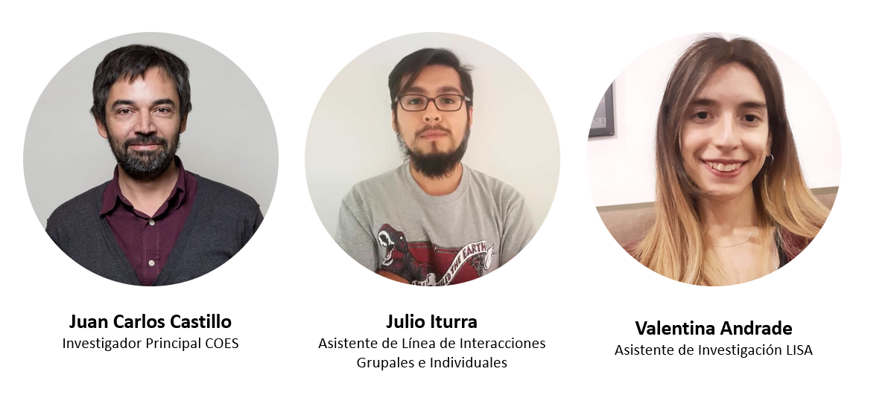
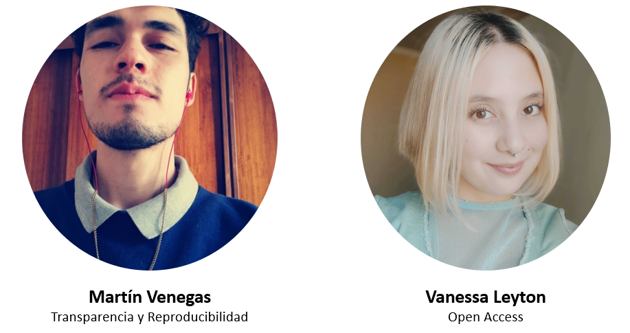
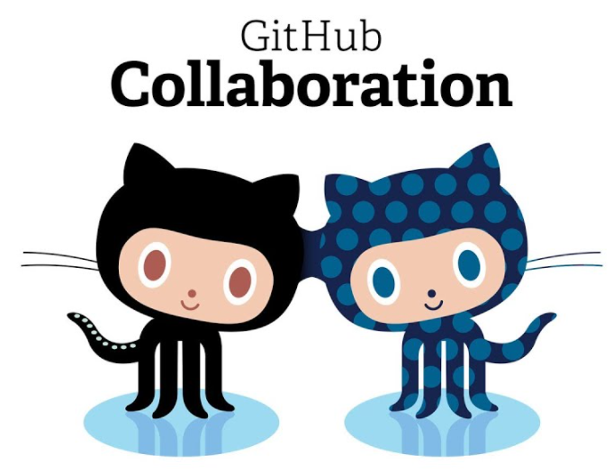
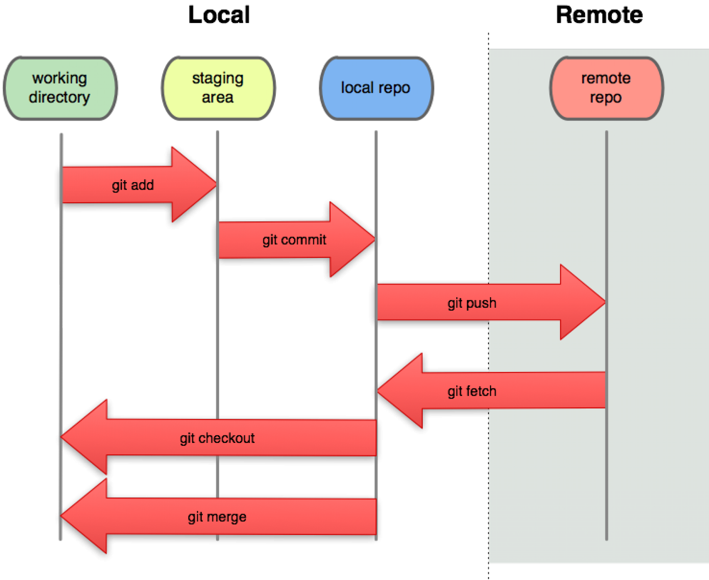
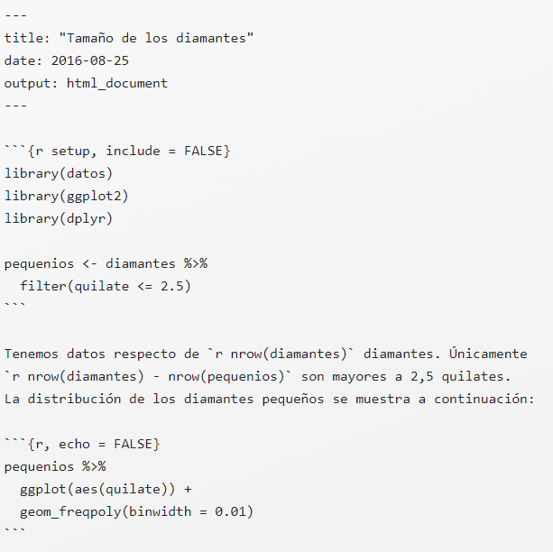
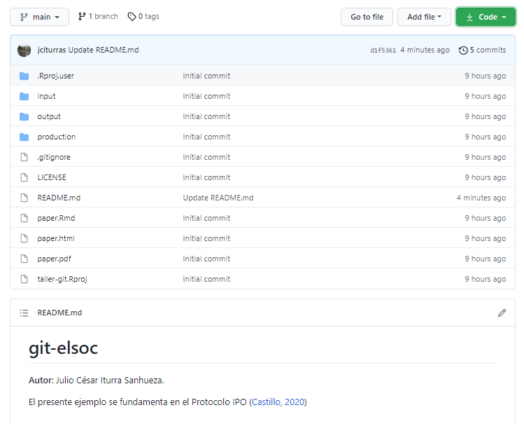

layout: true
class: animated, fadeIn

---
class: inverse, left, middle

# _Reproducibilidad y control de versiones usando GitHub._


Julio César Iturra Sanhueza $^1$

Martin Venegas $^2$


***
[Talleres de invierno ELSOC]()

<br>

#### Julio, 2021
##### $^1$ Centro de Estudios de Conflicto y Cohesión Social
##### $^2$ Universidad de Chile

---
# Contenidos de la sesión 


.left-column[

**Ciencia abierta**

1. Crisis en la ciencia

2. Reproducibilidad

**Control de versiones y reproducibilidad**

1. Conceptos centrales

2. Trabajo colaborativo

3. Repositorios: remote y local   

4. Clone, Branch, Commit, Push... pull request (?)
]


.right-column[
**Sección práctica**

1. Herramientas: Introducción a R Markdown

2. Ejercicio control de versiones
]
---
# Presentación

> El **Laboratorio de Ciencia Social Abierta** es una iniciativa del Centro de Estudios de Conflicto y Cohesión Social (COES) que tiene como propósito ser una guía para el desarrollo de una ciencia social abierta y reproducible para la comunidad científica y la ciudadanía. Nos enfocamos en promover y construir **herramientas de los tres componentes** principales de la ciencia abierta: (1) apertura de datos, (2) análisis reproducibles y (3) publicaciones libres.

<br>
<br>
<br>
.center[]

---
# Equipo



---

# Pasantes

.center[

]

---
class: middle, center, inverse

# _Transparencia y reproducibilidad_

---
# Crisis en la ciencia
.left-column[
* Ha sido entendida como un problema de **transparencia** en:
    * Diseños de investigación 
    * Procedimientos de investigación 
    * Apertura y acceso a materiales de investigación
    
* Dentro de las motivos y consecuencias:

    * Problemas para replicar (o reproducir) resultados
    * Confianza en los resultados se pone en duda
]

.right-column[.center[


Baker (2016)  
]
]


---
# Prácticas de investigación 

* Fabrication, Falsification, Plagiarism (Invención, Falsificación y Plagio - FPP)
* Prácticas cuestionables de investigación (QRP)
* Conducta Responsable de Investigación (RCR)

.center[
 

Gradación del comportamiento integro en investigación. Imagen de Abril Ruiz (2019) basada en Steneck (2006)]
---
# Caso de fraude: Diderik Stapel


.left-column[
* Prestigioso psicológo social
* 137 artículos publicados
* 54 artículos retractados
* **Motivo:** 
    * Falsificación y manipulación de datos
* **Consecuencias:** 
    * Desvinculado de la Tilburg University
    * Se le rebocó su título de doctorado
]


.right-column[

] 

---
# ¿Qué podemos hacer?

.left-column[

* Para incrementar la transparencia debemos actuar sobre los distintos **momentos de una investigación**

1. Diseño 
2. Procedimientos
3. Pre-publicación
4. Publicación 
]

.right-column[
* Crüwell et al. (2018) propone avanzar a una cultura que promueva:

  * Pre-registros
  * **Acceso abierto:** la importancia de los datos, material y código abierto.
  * Análisis **reproducibles**
  * La **replicación** 
  * Enseñanza de la ciencia abierta]


---
class: center, middle

# _ ¿Cuántas veces nos hemos enfrentado a un trabajo publicado que no comparte sus materiales, y que por tanto, es imposible acceder a los procedimientos que generaron sus resultados?_ 

---
# Reproducibilidad

* **No** lo vamos a entender como sinónimo de **replicar**
* Barba (2018) sugiere que la confusión entre reproducibilidad y replicabilidad ha contribuido a obstaculizar las prácticas en ambas dimensiones, identificado tres escenarios:

  * Escenario (A): ambos conceptos se usan como **sinónimos**.
  * Escenario B1:
      * **Reproducibilidad:** datos y métodos originales permiten **regenerar** resultados.
      * **Replicación:** datos nuevos y métodos originales obtienen mismos resultados.
  * Escenario (B2):
      * **Reproducibilidad:** datos y métodos nuevos obtienen mismos resultados.
      * **Replicación:** datos nuevos y métodos originales modificados obtienen mismos resultados.

---
class: middle, center


---
# ¿Cómo avanzamos?

* Prácticas de investigación orientadas a la reproducibilidad:

  * Publicación de datos (Dataverse, OSF)
  * Código de análisis abierto (Github, OSF)
  * Uso de software libre y de código abierto (R, Python, Markdown)
  * Protocolos de trabajo reproducible (TIER project)
  * Control de versiones (Git)

.center[


]


---
class: middle, center, inverse
# _Git: Conceptos Centrales_ 

---

# Control de versiones


.left-column[ 
.center[]
.center[**Existen control de versiones** ]
]


.left-column[]


---
# Control de versiones

.left-column[ 
.center[]
.center[**¡Y control de versiones!** ]
]

.left-column[]

---
# Control de versiones

* Un flujo de trabajo basado en **Git** facilita:
  
  1. Control sobre versiones de uno o más documentos.
  2. Observar "pasado y presente" de un proyecto completo.
  2. Apertura y transparencia (repositorios). 
  3. Trabajo Colaborativo
  4. **Estructura de proyectos**
  
---
# Colaboración

.left-column[

* Una de las ventajas de trabajar en un marco basado en Git es que podemos colaborar con diferentes personas dentro de un **mismo proyecto**. (p.ej. tutor-estudiante, equipo de trabajo, etc)

* Controlar qué es lo que _cambia_ y qué es lo que se _conserva_.

* **Aceptar** o **rechazar** cambios surgeridos por otr-s usuari-s 


]

.right-column[ ]

---
# Repositorios: remote y local


> **Repositorio**: Un directorio o espacio de almacenamiento donde pueden _vivir_ sus proyectos. A veces los usuarios de GitHub acortan esto a "repo". 

> Puede ser local a una carpeta de tu ordenador, o puede ser un espacio de almacenamiento en GitHub o en otro host online. Puedes guardar archivos de código, de texto, de imagen, lo que quieras, dentro de un repositorio.


.center[
]

---

**Clone**: Se utiliza para apuntar a un repositorio existente y crear un clon, o una copia del repositorio de destino. 

**Branch**: Una "branch" representa una línea independiente de trabajo. Las _branches_ sirven como una abstracción de los procesos de cambio, preparación y confirmación.

**Commit**: Una confirmación, o "revisión", es un cambio individual en un archivo (o conjunto de archivos). Con Git, cada vez que lo guardas se crea un ID único (también conocido como "SHA" o "hash") que te permite llevar un registro de qué cambios se hicieron cuándo y por quién.

**Push**: El comando "push" se usa para publicar nuevos commits locales en un servidor remoto.

**Fetch**: El comando "fetch" descarga commits, archivos y referencias de un repositorio remoto a tu repositorio local. "Fetch" es lo que haces cuando quieres ver en qué han estado trabajando los demás.


**Pull**: Se usa para recuperar y descargar contenido de un repositorio remoto e inmediatamente actualizar el repositorio local para que coincida con ese contenido. 

---

.center[]

---
**Pull request**: Son una característica específica de `GitHub.` Proporcionan una forma simple, basada en la web, de enviar tus cambios. En concreto, es pedirle al proyecto (main-branch) que extraiga los cambios de tu branch.

.center[]


---
# Propuesta de trabajo 


* En esta sección se presentará una propuesta de trabajo basada en branches independientes para cada tarea. Para ello, nos hemos basado en la estructura de proyectos usando el protocolo [**IPO** (Input- Procesamiento-Output)](https://cienciasocialabierta.netlify.app/class/06-class/).

.left-column[]

.right-column[
1. Branch para _**metodos**_ donde se pueden registrar procedimientos como la preparación y análisis de datos.
2. Branch para _**antecedentes**_ donde se pueden registrar todos los procedimientos referidos a revisión de literatura y escritura.
]


---
class: middle, center
# R Markdown

---

# Qué es

.left-column[
* R Markdown provee un marco de escritura para ciencia de datos, que combina tu **código**, sus resultados y tus comentarios. 

* Los documentos de R Markdown son completamente reproducibles y soportan formatos de salida tales como PDFs, archivos de Word y html.]

.right-column[

* Los archivos R Markdown están diseñados para ser usados de tres maneras:

  * Comunicación de resultados, es decir foco en el contenido y no en el formato.
  * Mantener un registro de los procedimientos de análisis.
  * Garantizar la **reproducibilidad** de los resultados.


]


---
### Formato
.left-column[
* Un documento R Markdown tiene una extensión `.Rmd`

  * Un encabezado YAML (opcional) rodeado de ---
  * Bloques de código de R rodeados de ``` (Chunks).
  * Texto mezclado con formateos de texto simple como # Encabezado e _itálicas_.

]

.right-column[

]

---
## knitr y pandoc

```{r, echo=FALSE, out.width='70%', fig.align='center', fig.pos="h!"}
knitr::include_graphics(c("https://github.com/jciturras/tutorial-rmarkdown/blob/master/images/rmarkdownflow.png?raw=true"))
```

El primer cuadro es su documento en R Markdown, donde escriben su código en R y lo combinan con texto. [Knitr](https://yihui.name/knitr/) es el paquete que convierte todo lo que ustedes escriben a formato Markdown (.md), lo cual posteriormente es transformado por [Pandoc](https://pandoc.org/) en cualquiera de los formatos que ustedes necesiten (.pdf, .html o .doc). El resultado de este proceso es su documento final.


---
**Usar chunks**

 * En RStudio se puede incluir usando: ctrl + alt + i

```{r,eval=FALSE, include=TRUE, echo=TRUE}
{r, eval=FALSE, , echo= TRUE, include=TRUE, results='asis'}
summary(mtcars)
x <- c(1,2,3,4)
```

* `eval=TRUE` Sirve para determinar si queremos que se ejecute el código y mostrar resultados.
* `echo=TRUE` Sirve para determinar si se muestra el código y sus resultados.
* `include=TRUE` Sirve para determinar si queremos que se incluya nuestro código.
* `message=FALSE` Sirve para determinar si queremos los mensajes emergente
* `warning=FALSE` Sirve para determinar si queremos las advertencias de R.
* `results='asis'` Permite que el código creado por las funciones de R sea empleado en la compilación. 

---
.left-column[
```{r, echo=TRUE, eval=F}
*cursiva*   o _cursiva_

**negrita**   __negrita__
`code`

superíndice^2^ y subíndice~2~

# Encabezado de primer nivel

## Encabezado de segundo nivel

### Encabezado de tercer nivel
```
]

.right-column[

*cursiva*   o _cursiva_

**negrita**   __negrita__

`code`

superíndice^2^ y subíndice~2~

# Encabezado de primer nivel

## Encabezado de segundo nivel

### Encabezado de tercer nivel

]

---

```{r, echo=TRUE, eval=F}
*   Elemento 1 en lista no enumerada

*   Elemento 2

    * Elemento 2a

    * Elemento 2b

1.  Elemento 1 en lista enumerada

1.  Elemento 2. La numeración se incrementa automáticamente en el output.
```


*   Elemento 1 en lista no enumerada

*   Elemento 2

    * Elemento 2a

    * Elemento 2b

1.  Elemento 1 en lista enumerada

1.  Elemento 2. La numeración se incrementa automáticamente en el output.


---

```{r, echo=TRUE, eval=F}
<http://ejemplo.com>

[texto del enlace](http://ejemplo.com)


```

<http://ejemplo.com>

[texto del enlace](http://ejemplo.com)

 
---
Ejecutar 

 


---
# El repositorio 


.left-column[,
.center[[jciturras/git-elsoc](https://github.com/jciturras/git-elsoc)]
]

.right-column[

**Estructura de carpetas y archivos**

```{r echo=TRUE,eval=F}
│   README.md
│   git-elsoc.Rproj
│   paper.Rmd
│   
├───input
│       data
│       ├───original
│       └───proc
├───output
│       tables        
│       images
└───production
        prod_prep.Rmd 
        prod_analysis.Rmd
        
```

]


---
class:middle, center
<iframe height="650" width="1200" frameborder="no" src="https://viewer.diagrams.net/?highlight=0000ff&edit=_blank&layers=1&nav=1&title=flujo-repos.drawio#Uhttps%3A%2F%2Fdrive.google.com%2Fuc%3Fid%3D1qdR28bRdakH_MztuTuXOh8qDmquDjJmN%26export%3Ddownload">
</iframe>

---
# Práctica

## Parte I: individual

1. Crear un repositorio independiente que se llame "taller-git".
2. Clonar localmente usando RStudio
2. Modificar localmente desde *main*
  * Realizar commit local
  * Realizar push hacia el repositorio remoto (en GitHub)
3. Chequear cambios online  
  
---
# Práctica
## Parte II: colaborativo

1. Clonar el repositorio [jciturras/git-elsoc](https://github.com/jciturras/git-elsoc.git) localmente usando RStudio.
2. Seleccionar una branch  (metodos o antecedentes)
3. Crear un archivo .Rmd para cada una de las branches
  * `metodos.Rmd`
  * `antecedentes.Rmd`
4. Lograr 'guardar' cambios a través de un commit en su branch respectiva
5. Realizar push hacia el repositorio remoto (en GitHub)
6. Pull Request $\rightarrow$ main (remote)

---
# Algunos tips de configuración 

En RStudio:

> Tools $\rightarrow$ Terminal $\rightarrow$ New Terminal (`Alt+Shift+R`)

```{r echo=TRUE,eval=F}
git config --global user.email "usuario2021@gmail.com" 
git config --global user.name "nombreusuario"
```

---
class: middle, center

### `r  fontawesome::fa(name = "github", fill = "black")` <br> [github.com/jciturras](https://github.com/jciturras) 


